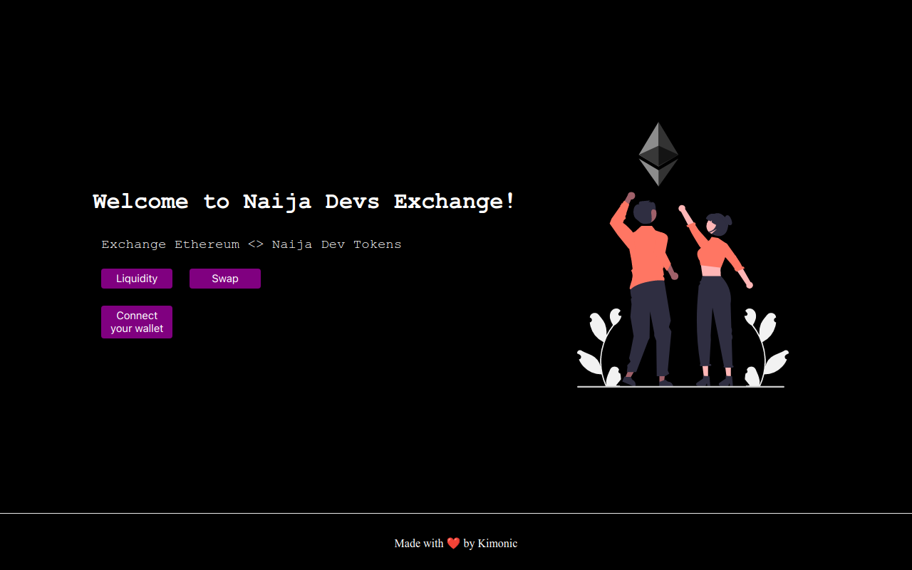

# 💎A Decentralized Exchange like Uniswap

### [LIVE SITE ](https://dex-uniswap-v1.vercel.app/) ⏩ https://dex-uniswap-v1.vercel.app/

Project Description:
This project is an implementation of Uniswap V1, a decentralized exchange built on Ethereum. 
Uniswap V1 allows users to exchange ERC-20 tokens directly from their wallets without the need for an intermediary. 
The exchange is automated and powered by a smart contract, allowing for trustless and secure trading.


- Build an exchange with only one asset pair (Eth / Naija Dev).
- Your Decentralized Exchange should take a fee of 1% on swaps.
- When user adds liquidity, they should be given Naija Dev LP tokens (Liquidity Provider tokens).
- ND LP tokens should be given proportional to the Ether user is willing to add to the liquidity.

Technologies Used:
This project utilizes Ethereum, Solidity, and JavaScript. 
Ethereum is a blockchain-based platform for smart contracts and decentralized applications. 
Solidity is a programming language used to write smart contracts for Ethereum. 
Finally, JavaScript is used to interact with the Ethereum blockchain and Uniswap contract.
The frontend was developed using Next framework and the backend is in solidity.

## Project Demo 🎥


## Directory Structure 📂
- `hardhat/contracts` ⏩ Smart Contract Code [Deployed @ Goerli Test Network]
- `frontend` ⏩ Project's React frontend.

## Run this project locally 🏃🏾‍♂️💨

```shell
git clone https://github.com/Kimonic99/DEX-uniswap-v1.git
```

### Frontend 🎨🖌

- `cd frontend`
- `npm install` Install Dependencies
- `npm run dev` Start the frontend in localhost 
- Open `http://localhost:3000` <br />
We can use the localhost frontend to interact with the smart contract on Goerli Network

### Backend 🔗

- `cd hardhat`
- `npm install` Install Dependencies
- `npx hardhat --version` Check if Hardhat is properly installed 
- `npx hardhat compile` Compile the Smart Contract
- `npx hardhat test` Test the Smart Contract Locally
- `npx hardhat run scripts/deploy.js` Deploy the Smart Contract Locally


### 💎 Contract Address 💎
[🚀  0x94F734108C6DA3ed427b79b8dBDF8B3B96441B63 🛸](https://goerli.etherscan.io/address/0x94F734108C6DA3ed427b79b8dBDF8B3B96441B63)
